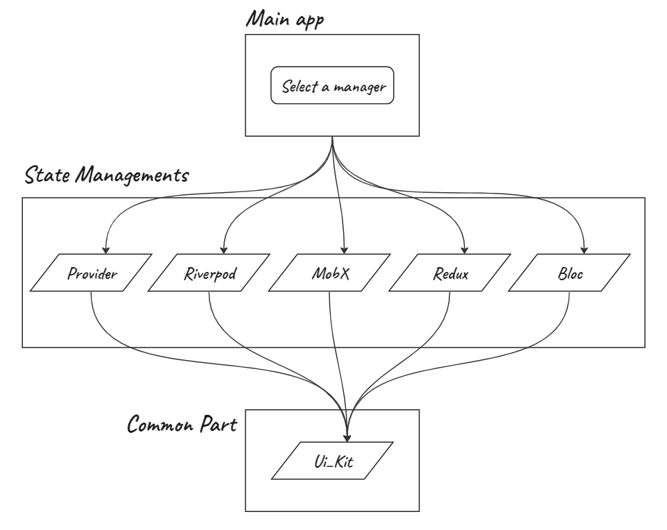

# State Management Exploration App

Are you looking to get started with one of the most popular state managements in Flutter? Don't know how to create a basic project setup? Or has your project become too confusing and you don't know how to resolve this? I suggest you take a look at this project. It was created as a set of templates that can be useful for the above questions, and just as a cheat sheet. So, feel free to get acquainted with it. I'll be very grateful for your comments and wishes.

Pokemon RESTful API: https://pokeapi.co/

# Scheme

This is a representation of how it works technically.

# Technology Stack

- [x] Flutter
- [x] Provider
- [x] Riverpod
- [x] MobX
- [x] Redux
- [x] Bloc
- [x] Http Client
- [x] Hive 
- [x] Dependency Injection
- [x] Code Generation
- [x] More in code 

# Motivation

The project provides the minimum required functionality needed to implement one of the five most popular state managements in your project.

The folder structure is based on a clean architecture recommended for developing and separating the business logic, user interface, and services needed for any Flutter project.

Instead of wasting time setting up a development structure on every new project, understand how the structure and components interact, then copy and paste into your project. This will help reduce common practices and code structure and allow us to quickly focus on the main part of the application. It may also be helpful to recall the basic principles of state management that you have used in the past or bring something new to your current project. Avoid re-writing the same code from scratch.

The goal of optimal code reuse was also pursued by moving the common code into some general module and using it by other modules.

# Project Goals

The main goal is to define a reference architecture that can be used as the foundation or just an example for Flutter app:

- Create a system that can share common user interface and business logic code and be independent of another implementations
- To reducing developer time in familiarization with new State Management system and re-writing common code and project structure from scratch
- To have a common folder and packages structure that can be further extended should it required
- Clearing define the layer system approach and folders that should they include

The 3 main layers:

- Data - contains implementation of services and repositories to interact between the app and 3rd party services such as APIs
- Domain - adding methods to the service and repository interface
- Presentation - changing your ViewModel and UI to reflect changes

# Was inspired by experience, articles and course: 

- https://habr.com/ru/articles/747062/
- https://markonovakovic.medium.com/clean-architecture-is-not-domain-data-presentation-e368d7ff8579
- https://www.youtube.com/watch?v=v0of23TxIKc&list=PLQkwcJG4YTCTimTCpEL5FZgaWdIZQuB7m